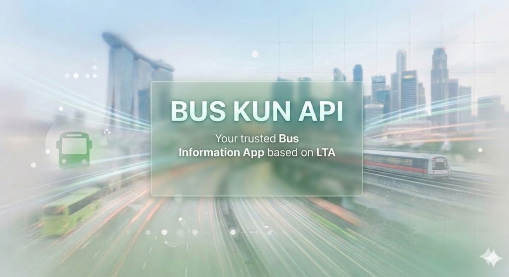
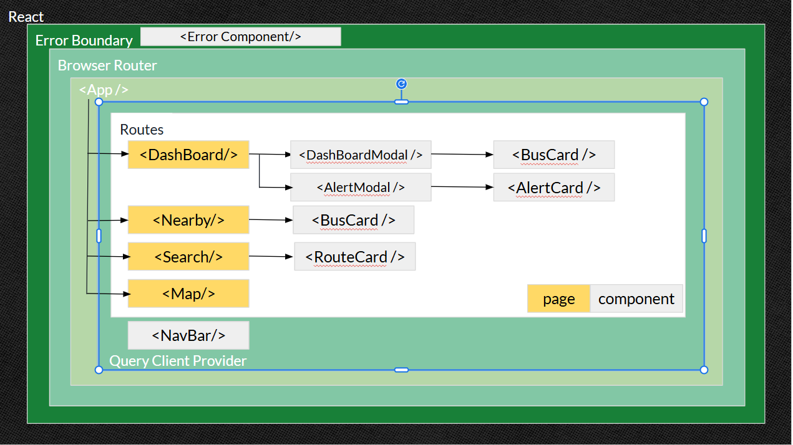

# PROJECT: BUS-KUN API, your trusted Bus Information App based on LTA

## Introduction

Welcome to the BUS-KUN API, your trusted Bus Information App based on LTA (Land Transport Authority). This API provides comprehensive and real-time bus information, including bus routes, arrival time, train disruption alerts and bus stop information. Whether you're a commuter looking for a efficient travelling solution or a developer building a transportation app, the BUS-KUN API has got you covered.

## Table of Contents

- [Features](#features)
- [Getting Started](#getting-started)
- [API Endpoints](#api-endpoints)
- [Technologies Used](#technologies-used)
- [Components Architecture and Providers](#components-architecture-and-providers)
- [Planning Phases](#planning-phases)
- [Best Practices & Optimization](#best-practices--optimization)
- [Challenges](#challenges)
- [Future Improvements](#future-improvements)
- [Attributions](#attributions)
- [License](#license)

## Features

### 📊 Dashboard: The main page of the app

- Displayed favourited bus stops with their corresponding bus services and arrival times.
  - Users can add or remove bus stops from their favourites list by clicking the heart icon next to each bus stop.
  - Favourited bus stops are sorted by distance from the user's current location, with the closest bus stops appearing at the top of the list.
- News alert from LTA regarding train disruptions
  - Flashing alert button in the event of a train disruption, with a pop-up message providing details about the disruption and whether if there is any free bus shuttle service provided.

### 📍 Nearby: Looking around

- Displayed nearby bus stops within a 400m radius of the user's current location, along with their corresponding bus services and arrival times.
  - Users can add bus stops to their favourites list by clicking the heart icon next to each bus stop.
  - Nearby bus stops are sorted by distance from the user's current location, with the closest bus stops appearing at the top of the list.

### 🔎 Search: Search for bus route

- Users can search for bus routes by entering a bus stop number or a bus service number.
  - Bus routes available for both loop and bidirectional bus services.
- At Dashboard and Nearby page, users can click on a bus service number to navigate to the search page
  - Bus service number will be pre-filled in the search bar, and get the bus route information automatically.

### 📡 Map: Visualize bus stops on map

- Users can view bus stops on a map, with markers indicating the location of each bus stop.
  - Clicking on a marker will display the bus stop number and further click will navigate to the nearby page.
- With fetch location, users can see their current location on the map, and the map will automatically center on their location.
  - Location name appears giving users a better understanding of their current location.

## Getting Started

Go to my Netlify page: [https://bus-kun-api.netlify.app/](https://bus-kun-api.netlify.app/)

### 🔑 Environment Setup

Create a `.env` file in the root directory and add the following:

```text
VITE_ACCKEY=your_lta_datamall_key
VITE_AIRTABLE_TOKEN=your_airtable_token
VITE_AIRTABLE_URL=https://api.airtable.com/v0/your_airtable_base_id
VITE_BUSARRIVAL_URL="/ltaodataservice/v3/BusArrival?BusStopCode="
VITE_ALERT_URL="/ltaodataservice/TrainServiceAlerts"
VITE_LOCATION_URL="https://nominatim.openstreetmap.org/reverse?format=jsonv2"
```

### 🚀 Quick Start

1. **Clone the repo:**
   `git clone https://github.com//lklim050/Bus-Kun-API`
2. **Install dependencies:**
   `npm install`
3. **Run in development mode:**
   `npm run dev`

### 🌐 A Note on CORS & Proxies

To handle LTA's XML data and avoid CORS issues, this project uses:

- **Development:** Proxy configured in `vite.config.js`.
- **Production:** Reverse proxy configured in `netlify.toml`.
  There is no need to configure as those were already included in the repository.

## 📲 API Endpoints

- **Bus Arrival Information:**
  - Endpoint: `/ltaodataservice/v3/BusArrival?BusStopCode={busStopCode}`
  - Description: Retrieves real-time bus arrival information for a specific bus stop.
  - Parameters:
    - `busStopCode` (required): The code of the bus stop to retrieve information for.
- **Bus Route Information:**
  - Endpoint: `/map/busService/bus_route_xml/{busServiceNumber}`
  - Description: Retrieves the bus route information for a specific bus service number.
- **Train Service Alerts:**
  - Endpoint: `/ltaodataservice/TrainServiceAlerts`
    - Description: Retrieves current train service alerts and disruptions.
- **Location Information:**
  - Endpoint: `https://nominatim.openstreetmap.org/reverse?format=jsonv2&lat={latitude}&lon={longitude}`
  - Description: Retrieves location information based on latitude and longitude coordinates.
  - Parameters:
    - `latitude` (required): The latitude coordinate of the location.
    - `longitude` (required): The longitude coordinate of the location.
- **Airtable API:**
  - Endpoint: `https://api.airtable.com/v0/{baseId}/`
  - Description: Retrieves and manages user data such as favourited bus stops.
  - Parameters:
    - `baseId` (required): The ID of your Airtable base.
- **Map Data:**
  - Endpoint: `https://{s}.tile.openstreetmap.org/{z}/{x}/{y}.png`
  - Description: Retrieves map tiles for rendering the map interface.
  - Parameters (please look for leaflet documentation for more details):
    - `s` (required): The subdomain for the tile server (e.g., a, b, c).
    - `z` (required): The zoom level of the map.
    - `x` (required): The x-coordinate of the tile.
    - `y` (required): The y-coordinate of the tile.

## 💡 Technologies Used

- **Frontend**:
  - React, React-DOM v19.1.1
- **Styling CSS**:
  - Tailwind CSS, PostCSS 8.5.14
- **State Management / Data Fetching**:
  - TanStack React Query v5.100.8
- **Routing**:
  - React Router v7.14.2
- **Mapping & Geolocation**:
  - Leaflet v1.9.4
  - React-leaflet v5.0.0
- **Error Handling**:
  - React-Error-Boundary v6.0.0
- **Build & Development Tools**:
  - Vite (v7.1.7)
  - ESLint (v9.36.0)
  - @vitejs/plugin-react (v5.0.4)
- **Language & Syntax**:
  - ES6+
  - JSX
- **External Integration**:
  - Airtable API
  - LTA Data Mall API
  - OpenStreetMap Nominatim API
- **Deployment**:
  - Netlify

## 📚 Components Architecture and Providers



**App**

- Dashboard
  - DashBoardModal
    - BusCard
  - AlertModal
    - AlertCard
- Nearby
  - BusCard
- Search
  - RouteCard
- Map

## 📜 Planning Phases

- **Phase 1: Testing and Design**
  - Conducted research on LTA's APIs and data formats.
  - Fetch and tested API endpoints with Bruno
  - Check if data can render on frontend for any potential issues with CORS, data format, etc.
  - Found CORS error and resolved it with proxy server for development
  - Know what components and pages to create.
- **Phase 2: Development**
  - Install all necessary dependencies such as React Router and TanStack Query.
  - Implemented the Dashboard, Nearby, Search as pages with their respective features.
  - Create reusable components such as BusCard
  - Refactor functions that were shared by multiple pages and components
  - Optimize performance with TanStack Query for caching and state management.
  - Implemented error handling with React-Error-Boundary to catch and display errors gracefully.
- **Phase 3: Expansion**
  - Install Tailwind CSS and refactor the styling of the app to make it more visually appealing and responsive.
  - Implement Modal components to display train disruption news and bus stop information.
  - Improve the Search page function with bus route information for both loop and bidirectional bus services.
  - Implement Map page to visualize bus stops on a map using Leaflet and React-Leaflet.
  - Added location name on the map page to give users a better understanding of their current location.

## 🛡️ Best Practices & Optimization

- **Security:** API keys are managed via environment variables (`.env`) to prevent exposure in the source code.
- **Resilience:** Defensive Programming is implemented so that the app can handle unexpected API responses or network issues without crashing.
- **Performance:** Used TanStack Query for caching and stale-time management, reducing overfetching and improving response times.
- **Production Proxy:** Configured a reverse proxy in `netlify.toml` to bypass CORS and manage cache headers at the edge.

## 🔧 Challenges

- **CORS Issues:** LTA's API does not support CORS, which posed a challenge for frontend development. This was resolved by implementing a proxy server during development and configuring a reverse proxy for production deployment on Netlify.
- **Data Format Handling:** One of the LTA's API returns data in XML format, which required additional parsing and handling on the frontend. This was addressed by implementing a XML parser (DOMParser) to convert the raw data into text and back to XML for transformation into renderable JSON array/object format using DOM manipulation methods.
- **Real-Time Data Management:** Managing real-time data updates for bus arrivals and train disruptions required careful consideration of caching strategies and state management. This was optimized using TanStack React Query to handle data fetching, caching, and rate-limiting efficiently.

## 💡 Future Improvements

- UI/UX Enhancements: Further refine the user interface and experience based on user feedback, including improving the design and adding more interactive elements.
- Additional Features: Implement additional features such as user authentication, personalized notifications for bus arrivals, and integration with other transportation services (e.g., MRT, taxis).

## 💎 Attributions

- AI Tools: Gemini and Copilot
  - Assisting in debugging, CORS resolution, error handling, Tailwind CSS styling, Netlify deployment.
- LTA Data Mall: Providing the bus arrival and train disruption data that powers the core functionality of the app.
- LTA Bus Routes API: Providing bus route information for both loop and bidirectional bus services.
- OpenStreetMap Nominatim API: Providing location information based on user coordinates for the map feature.
- Airtable: Used for managing user data such as favourited bus stops.
- Leaflet and React-Leaflet: Used for rendering the map interface and visualizing bus stops.

Inspired by great bus information apps such as MyTransport.SG and SG BusLeh. Thankful to Cheeaun and his various bus projects, introducing to API for bus route (www.lta.gov.sg/map) and bus stop json file which is crucial for my Nearby and Map page.

Last but not least I would like to thank my peers and instructor (SEB SGP classroom 62) for their support and feedback throughout the development process. Your insights and encouragement were invaluable in helping me overcome challenges and improve the game.

## 🗃️ License

MIT. Data is copyrighted by LTA, Leaflet, OpenStreetMap, Nominatim.
